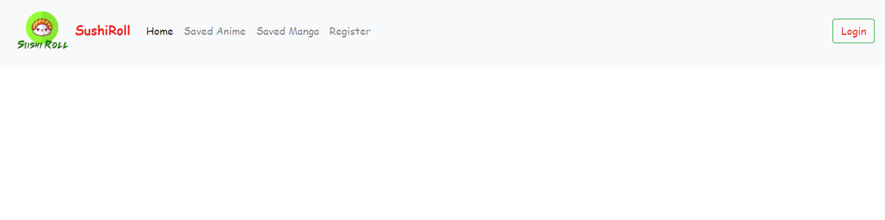

# project-3

Sushiroll is a react app that allows users to search for their favorite Anime or Manga and find pertinent information. The user can then save their favorite Anime or Manga.

# Concept

We are Anime fans and we wanted to do a project that was fun and was based on something we both like. David wanted to do an Anime based app for project two, but his team didn't want to. David spoke to Ben about doing it for project three and he agreed.

# How the application works

The user register's their name, email address and password so they can login and use the app. Firebase is used for user authentication and their credentials are saved in a mongoose database. Once the user is logged in, they can type in the title of an Anime or Manga and there is a table written in JSX that tells you how many episodes or chapters are in the Anime or Manga, as well as other information. The user can then save their favorite Anime or Manga in mongoose and it will be stored there for the user to see upon the next time they login.

# Techonologies Used

1. React Js (https://www.npmjs.com/package/create-react-app)
2. Axios (https://www.npmjs.com/package/axios)
3. Express (https://www.npmjs.com/package/express)
4. If-Env (https://www.npmjs.com/package/if-env)
5. Mongoose (https://www.npmjs.com/package/mongoose)
6. Firebase (https://www.npmjs.com/package/firebase)
7. Node-Sass (https://www.npmjs.com/package/node-sass)
8. React-Router-DOM (https://www.npmjs.com/package/react-router-dom)
9. React-Table (https://www.npmjs.com/package/react-table)

# Environment Setup

1. Clone the repo at (https://github.com/davidmstanleyjr/project-3)
2. Create a react app by typing *npx create-react-app my-app* and then *npm init react-app my-app*
3. Install npm packages by typing *npm install*.
4. Cd into the repo by typing *cd project 3*.
5. Start the server by cding into the react folder and typing *npm start*.

# Live Page

The deployed app can be found at (https://desolate-shelf-21688.herokuapp.com/)

Thank you and I hope you enjoy our project.

# Screenshots

